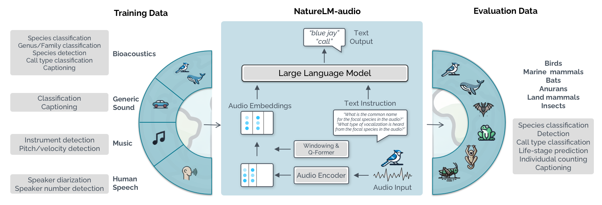

# NatureLM-audio: an Audio-Language Foundation Model for Bioacoustics



NatureLM-audio is a multimodal audio-language foundation model designed for bioacoustics. It learns from paired audio-text data to solve bioacoustics tasks, such as generating audio-related descriptions, identifying and detecting species, and more. NatureLM-audio was introduced in the paper:

> [NatureLM-audio: an Audio-Language Foundation Model for Bioacoustics](https://openreview.net/forum?id=hJVdwBpWjt)
> David Robinson, Marius Miron, Masato Hagiwara, Olivier Pietquin
> ICLR 2025

## Requirements

- Python 3.10+
- [uv](https://github.com/astral-sh/uv) (recommended, but optional)
- Access to [Meta Llama 3.1 8B Instruct](https://huggingface.co/meta-llama/Llama-3.1-8B-Instruct)

Make sure you're [authenticated to HuggingFace](https://huggingface.co/docs/huggingface_hub/quick-start#authentication) and that you have been granted access to Llama-3.1 on HuggingFace before proceeding. You can request access from: https://huggingface.co/meta-llama/Llama-3.1-8B-Instruct

## Installation

Clone the repository and install the dependencies:

```bash
git clone https://github.com/earthspecies/NatureLM-audio.git
cd NatureLM-audio
uv sync
```

Project entrypoints are then available with `uv run naturelm`.

If you're not using `uv` you can install the package and its depdencies in your environment of choice with:

```
pip install -r requirements.txt
```

## Running the inference web app

You can launch the inference app with:

```
uv run naturelm inference-app --cfg-path configs/inference.yml
```

This launches a local web app where you can upload an audio file and prompt the NatureLM-audio model.

## Instantiating the model from checkpoint

You can load the model directly from the HuggingFace Hub:

```py
from NatureLM.models import NatureLM

model = NatureLM.from_pretrained("EarthSpeciesProject/NatureLM-audio")
```

## Citation

If you use NatureLM-audio or build upon it, please cite:

```bibtex
@inproceedings{robinson2025naturelm,
  title     = {NatureLM-audio: an Audio-Language Foundation Model for Bioacoustics},
  author    = {David Robinson and Marius Miron and Masato Hagiwara and Olivier Pietquin},
  booktitle = {Proceedings of the International Conference on Learning Representations (ICLR)},
  year      = {2025},
  url       = {https://openreview.net/forum?id=hJVdwBpWjt}
}
```
